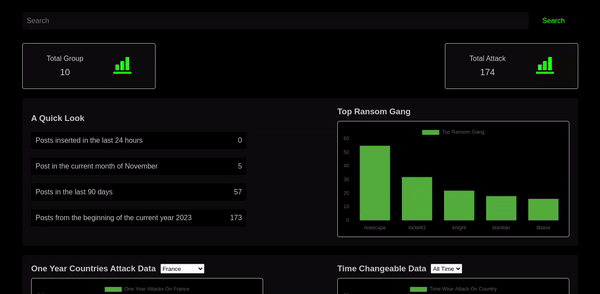

# Cyber Dashboard Template

The **Cyber Dashboard** project is an open-source initiative aimed at visualizing and analyzing data related to cyber threats and attacks. This interactive dashboard, created using HTML, JavaScript, and CSS, provides insightful visual representations of the topmost hacker groups, attacked countries, and victims of cybercrime. The project includes *index.html* for the webpage structure, *index.js* for handling data and interactions, *style.css* for defining the dashboard's visual aesthetics, and sample data for testing and demonstration purposes. With its user-friendly interface and easily customizable elements.

## Preview


## Installation

Install Cyber-Dashboard with git

```bash
  git clone https://github.com/thecaptaan/Cyber-Dashboard.git
  cd Cyber-Dashboard

  #run your local server
```
    
## Contribution
Feel free to contribute to this project by adding new features, enhancing the visualization capabilities, or incorporating real-time data updates.
## Support

For support, email captaan@xorblin.com